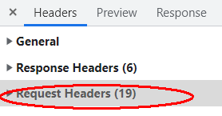
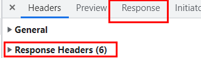

# http
http 协议:超文本传输协议 规定浏览器与万维网直接的通信规则

## 请求报文

重点格式和参数
```
行  POST /s?ie=utf-8 HTTP/1.1
头  Host: atguigu.com
    Cookie: name=guigu
    Content-type: application/x-www.-form-urlencoded
    User-Agent: chrome 83
空行
体  username=admin&password=admin
```


get 请求体可以没有请求体

## 响应报文
```
行  HTTP/1.1 200 ok
头  Content-Type: text/html;charset=utf-8
    Content-length:2048
    Content-encoding:gzip

空行(必须得有)
体
<html>
    <head>
    <body>
        <h1>hello world </h1>
    </body>
    </head>
</html>
```


### 响应状态
* 404 
* 403 
* 401
* 200
* 500
